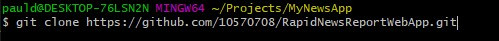
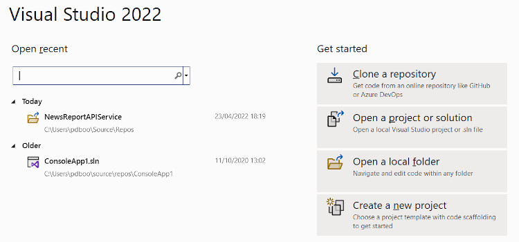
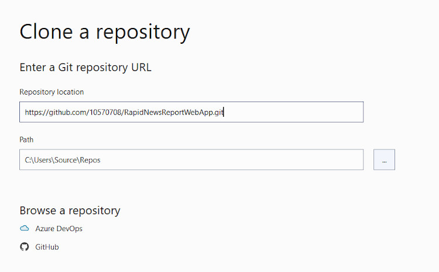
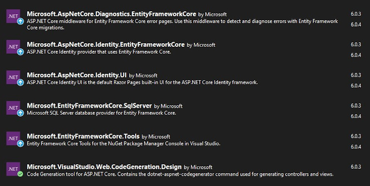

# RapidNewsReportWebApp: Setup

## Clone the Project Files

The files are in the folowing github repository: 
[RapidNewsReportWebApp](https://github.com/10570708/RapidNewsReportWebApp.git)
(https://github.com/10570708/RapidNewsReportWebApp.git)

Clone the files locally using either 

### Command Line

- Open GitBash and create the local directory for your project
- Go to that directory
- Type git clone in the terminal, paste the URL for the Application, and press “enter” to create your local clone.

*or*

### Directly in Visual Studio 2022 
- Open Project
- Select 'Clone a repository' 

- Enter the Github URL 
- Enter the path to your local directory
- Click Clone

## Open the Solution in Visual Studio 2022

- Load the solution
- Make sure in the Package Manager Console that it is set as the 'Default Project'
- In the Package Manager Console run the commands: 
    *(wait for the build to complete after each command)*
 
1.    `Add-Migration InitialCreate`

    Output:  
    
    `Build started...` 

    `Build succeeded`

2.    `Update-Database`

   Output:  
    
    `Build started...` 

    `Build succeeded`

**The package dependencies shuld be managed automatically, but if not, use NuGet Package Manager to install them. The list of required NuGet Packages is: **

## Run the Application 

- The application can now ne run, however there are configuration settings to consider before doing so. 
 
	[Configuration setting & pre-requisites](config.md)

[Back to Index](index.md)

