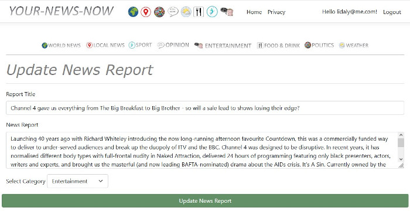

# RapidNewsReportWebApp: The Web UI functionality

## Once the setup and configuration steps have been followed, the application can be run in Visual Studio. The following functionality is available.
### The application will open in a browser window ( as per [configuration settings](config.md) )

*To use the application, 
- register to create an account
- verify the account
- login

*The Report and Comment APIs are seeded with News Reports and Comments*

## Register
- Standard .net registration - create account & validate
## Login
- Standard .net login 

## News Reports / Comments
*The Web Application is seeded with News Reports and Comments*

**1. View / Filter News Reports**
- The Home Page provides a listing of News Reports
- The Add News Report link is on the Home Page
- There is a Filter feature to filter by Type/ View Yours or All / Date
- Beside your own Reports is a View / Update / Delete link
- Beside other people's Reports is a View link

**2. Add News Report**
- Add a News Report and choose to Publish now or not 

**3. Update News Report**
- Update the News Report details 

**4. View News Report**
- Display News Report
- Option to Edit / Delete* / Publish if you own the Report
- News Report Comments: 
    - Add Comment 
    - List Comments 
    - Edit / Delete a Comment (if it is your Comment)

**Deletes Comments associated with Report also*

[Back to Index](index.md)

